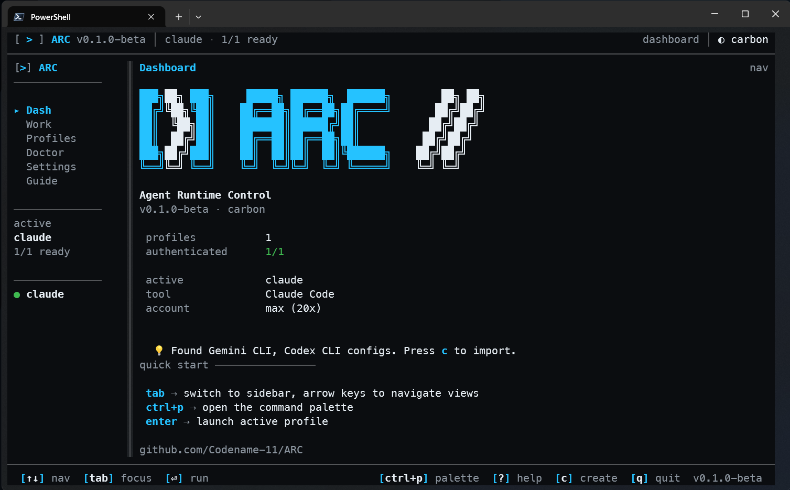
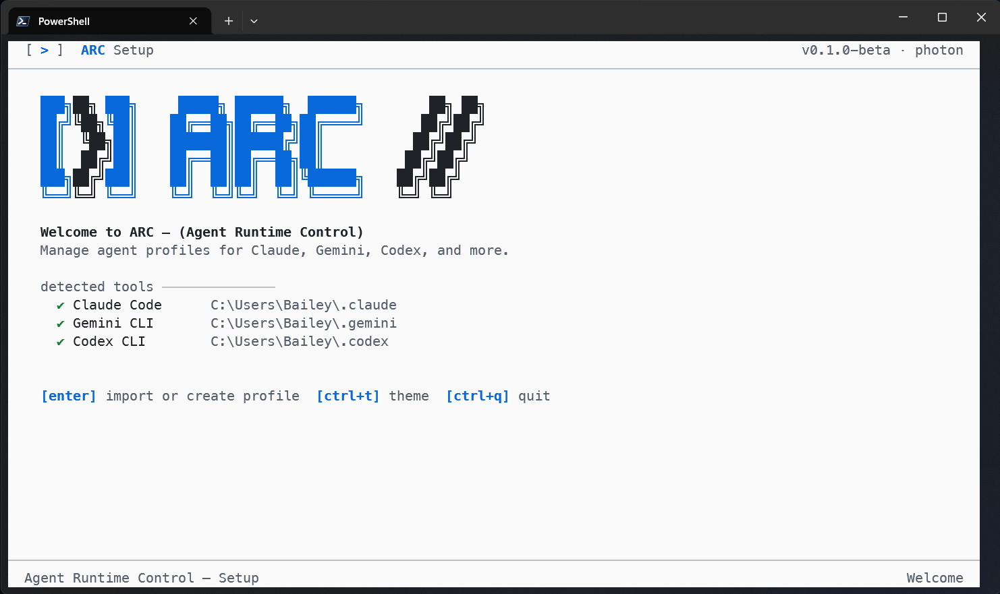
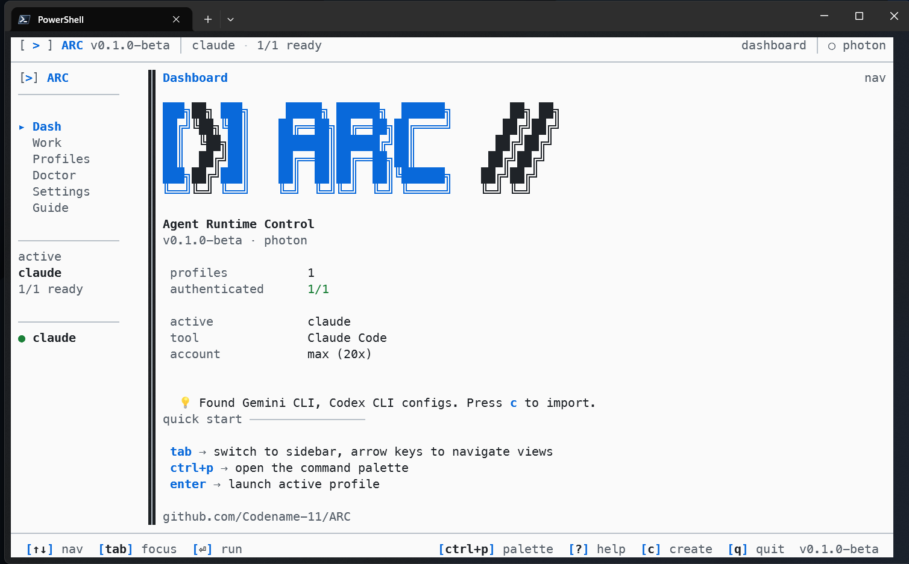
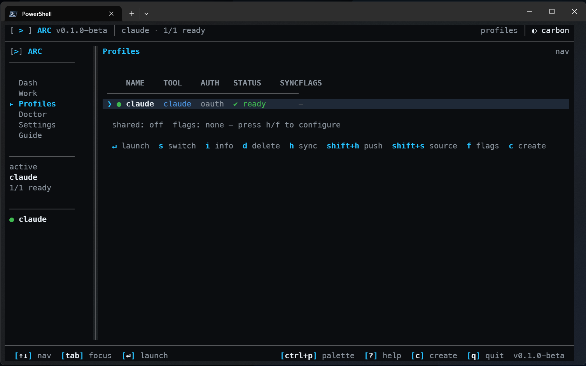
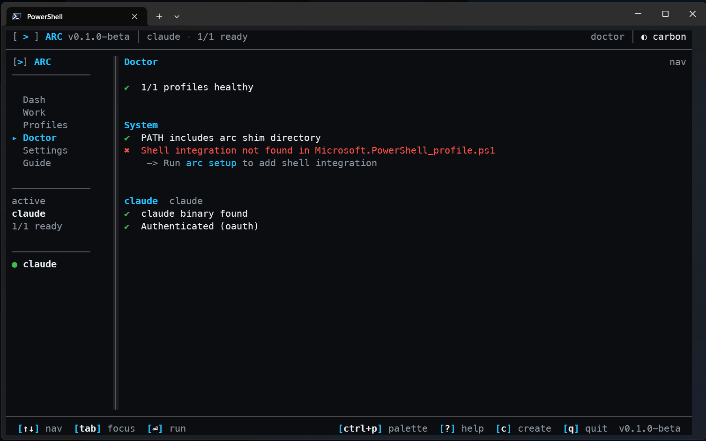

<p align="center">
  
</p>

<h1 align="center">ARC — Agent Runtime Control</h1>

<p align="center">
  Unified agent runtime control plane for AI coding assistants.<br>
  Profiles, supervision, hooks, memory, tasks, telemetry, and a web dashboard — one tool to run them all.
</p>

<p align="center">
  <a href="https://www.npmjs.com/package/@axiom-labs/arc-cli"></a>
  <a href="https://opensource.org/licenses/MIT"></a>
  <a href="https://nodejs.org"></a>
  <a href="https://github.com/Codename-11/ARC/actions/workflows/ci.yml"></a>
</p>

<p align="center">
  <a href="https://arc-cli.dev/docs/guide/">Documentation</a> ·
  <a href="https://arc-cli.dev/docs/guide/getting-started">Install</a> ·
  <a href="https://arc-cli.dev/docs/features/">Features</a> ·
  <a href="https://arc-cli.dev/docs/architecture/">Architecture</a> ·
  <a href="https://arc-cli.dev/docs/reference/cli">CLI Reference</a>
</p>

---

<p align="center">
  
</p>

## What is ARC?

ARC started as a profile manager for agent CLIs (v0.1). It has since absorbed the [Axiom-Supervisor](https://github.com/Codename-11/axiom-supervisor) project and implements all 25 phases of the [v2.0 spec](./docs/spec/SPEC.md) — becoming a unified control plane for the full lifecycle of AI coding agents.

One binary. One config directory (`~/.arc/`). Every agent runtime — Claude Code, Codex CLI, Gemini CLI, OpenClaw, or anything that speaks MCP/HTTP/stdio.

## Features

| Layer | Capabilities |
|-------|-------------|
| **Identity** | Named profiles, credentials, auth (OAuth/API key/Bedrock/Vertex/Foundry), OS keyring, env isolation |
| **Launch** | Tool detection, shell shims, per-profile flags, workspace-aware auto-selection (`arc.json`) |
| **Adapters** | Claude Code (SDK bridge + hooks + plugin), Codex CLI, Gemini CLI, OpenClaw, Generic (MCP/HTTP) |
| **Supervision** | Hook pipeline (4-mode enforcement), risk classification, preflight/postflight, retry loops, circuit breaker |
| **MCP** | Dual-role: host (connect to tool servers) and server (expose 5 supervision tools via stdio/HTTP) |
| **Memory** | Session + persistent memory, exponential decay scoring, keyword search, auto-extraction from conversation |
| **Skills** | Directory-based skill loading, MCP-to-skill adapters, self-improving skillify, stuck detector |
| **Tasks** | Task CRUD, cron scheduling, agent-to-agent message bus |
| **Sessions** | Create/suspend/resume/complete lifecycle, resume-intent detection |
| **Permissions** | Three-tier model (coordinator/interactive/worker) with deny > ask > allow precedence |
| **Telemetry** | OpenTelemetry spans, JSONL + console + OTLP exporters, `arc.*` attribute namespace |
| **Web Dashboard** | REST API (10 endpoints), WebSocket real-time push, SPA with 13 view components (+ Profiles, Diagnostics, Sync, Plugins) |
| **Dark Factory** | Autonomous operation mode: spec in, software out — state machine with wave progression |
| **Secrets** | Encrypted secret store (Argon2id KDF, AES-256-GCM per-entry), `arc secret` CLI |
| **Sync** | Shared config layer, cloud sync provider interface, filesystem sync with atomic writes |
| **Plugins** | JSON-backed plugin registry with semver compatibility, install/uninstall/enable/disable |
| **Remote Agents** | Registry for remote agents (HTTP/SSH/MCP transports) with health checks |
| **Shared Layer** | Sync MCP servers, commands, CLAUDE.md, memory, and projects across profiles |
| **TUI Dashboard** | Interactive terminal UI with profiles, diagnostics, settings, guide, and workspace shell |
| **Self-Update** | Built-in version check and `arc update` for self-updating |

## Architecture

```
┌─────────────────────────────────────────────────────────────┐
│                     ARC CLI / TUI / Web                      │
│  Profiles · Credentials · Dashboard · Doctor · Onboarding    │
│  TUI: quick ops (Ink)  ·  Web: deep observability            │
├─────────────────────────────────────────────────────────────┤
│                    Orchestration Layer                        │
│  Hook Pipeline · Risk Classifier · Retry Loop · Roundtable   │
│  Session Tracker · Alert Engine · Scope Tracker · Traces     │
│  Circuit Breaker · Dark Factory Controller                   │
├──────────┬──────────┬──────────┬──────────┬─────────────────┤
│  Claude  │  Codex   │  Gemini  │ OpenClaw │  Generic        │
│  Adapter │  Adapter  │  Adapter │  Adapter │  Adapter        │
│  SDK +   │  Process │  Process │  Plugin  │  MCP Server     │
│  Hooks + │  Wrap +  │  Wrap +  │  API +   │  or HTTP        │
│  Plugin  │  MCP +   │  MCP +   │  Hooks   │                 │
│  System  │  JSON    │  stdio   │          │                 │
├──────────┴──────────┴──────────┴──────────┴─────────────────┤
│                     Protocol Layer                           │
│  MCP Host (connect to tool servers)                          │
│  MCP Server (expose ARC supervision as tools)                │
│  A2A Agent Cards (capability discovery + task delegation)    │
├─────────────────────────────────────────────────────────────┤
│                      Storage Layer                           │
│  Profiles & Config (~/.arc/)  ·  OS Keyring (credentials)    │
│  JSON stores (tasks, sessions, memory, plugins, agents)      │
│  JSONL traces  ·  OpenTelemetry Export (OTLP)                │
└─────────────────────────────────────────────────────────────┘
```

## Package Structure

ARC is a pnpm monorepo:

```
packages/
  core/              # Hook bus, risk classifier, config, types, health, lifecycle,
                     # process, workspace, adapters, secrets, circuit breaker,
                     # context manager, permissions, telemetry, memory, skills,
                     # tasks, sessions, plugins, remote agents, factory, sync
  cli/               # Commander.js commands, TUI (Ink), auth, detect, import,
                     # shared layer, swap, update, shell integration
  mcp/               # MCP server (5 supervision tools) + host manager + HTTP transport
  adapter-claude/    # Claude Code adapter (SDK bridge, auth, detect, import, shared)
  adapter-openclaw/  # OpenClaw adapter (plugin manifest, hooks, tools)
  dashboard/         # Web dashboard: REST API, WebSocket, SPA frontend
site/                # React landing site (Vite + Tailwind v4)
```

## Installation

### npm (recommended)

```bash
npm install -g @axiom-labs/arc-cli
arc setup
arc
```

### From source

If you prefer to build from source or want to contribute:

```bash
git clone https://github.com/Codename-11/ARC.git
cd ARC && pnpm install
pnpm build
node dist/index.js setup
```

See [Getting Started](https://arc-cli.dev/docs/guide/getting-started) for requirements and platform notes.

## Quick Start

**Fastest path — no profile:**

```bash
arc run claude         # Native passthrough — no env injection, no overlay
arc run gemini
arc run codex
```

**Full path — with a profile:**

```bash
arc                    # Open TUI — onboarding wizard on first run
```

The onboarding wizard auto-detects installed tools (Claude, Gemini, Codex) and offers to import their configs as profiles.

```bash
arc create work --tool claude --auth-type oauth
arc launch work                     # native by default (full TTY handoff)
arc launch work --worker            # under ARC supervision for hooks/orchestration
arc use personal
arc status
```

## Screenshots

| | |
|---|---|
|  |  |
| First launch — onboarding wizard | Dashboard — light mode |
|  |  |
| Dashboard — dark mode | Profile management |
|  | |
| Diagnostics | |

## Usage

### Profiles

```bash
arc create <name>                  # Create a profile
arc list                           # List all profiles
arc use <name>                     # Switch active profile
arc profile show [name]            # Show profile details
arc profile delete <name>          # Delete a profile
arc profile import                 # Import existing tool config
arc profile switch none            # Clear the active profile
arc profile clear-active           # Same — activeProfile becomes null
arc which                          # Show resolved profile source
```

### Launch

```bash
arc run <tool>                     # Native passthrough (no profile, no overlay)
arc launch [name]                  # Launch agent tool with profile (native by default)
arc launch [name] --native         # Force full TTY handoff
arc launch [name] --worker         # Force ARC-supervised mode (for orchestration)
arc launch --bare <tool>           # Same as `arc run`
arc launch [name] -- --model opus  # Pass flags through to the tool
```

### Dashboard

```bash
arc                                # Open TUI dashboard
arc dashboard                      # Same — explicit command
arc web                            # Open web dashboard
```

### Sessions & Tasks

```bash
arc sessions list                  # List all sessions
arc sessions show <id>             # Show session details
arc tasks create <title>           # Create a task
arc tasks list                     # List tasks
arc tasks update <id> --status done  # Update task status
```

### Memory & Skills

```bash
arc memory search <query>          # Search persistent memory
arc memory list                    # List stored memories
arc skills list                    # List loaded skills
arc skills load <dir>              # Load skills from directory
```

### MCP

```bash
arc mcp serve                      # Start ARC as an MCP server (stdio)
arc mcp serve --transport http     # Start with HTTP transport
arc mcp connect <uri>              # Connect to an external MCP server
arc mcp list                       # List connected MCP servers
arc mcp disconnect <name>          # Disconnect from an MCP server
```

### Secrets

```bash
arc secret set <key> <value>       # Store an encrypted secret
arc secret get <key>               # Retrieve a secret
arc secret list                    # List secret keys
arc secret delete <key>            # Delete a secret
```

### Telemetry & Logs

```bash
arc logs                           # View structured logs
arc logs --level error --limit 20  # Filter logs
arc telemetry status               # Show telemetry config
```

### Factory & Remote

```bash
arc factory start <spec>           # Start dark factory run
arc factory status                 # Show factory state
arc remote list                    # List registered remote agents
arc remote register <url>          # Register a remote agent
```

### Plugins & Sync

```bash
arc plugins list                   # List installed plugins
arc plugins install <name>         # Install a plugin
arc sync status                    # Show sync state
arc sync push                      # Push to sync provider
arc sync pull                      # Pull from sync provider
```

### Shared Layer

```bash
arc shared pull [name]             # Push config to shared layer
arc shared enable [name]           # Sync shared config to a profile
arc shared sync                    # Re-apply to all enabled profiles
```

### Lifecycle

```bash
arc setup                          # Install shims, PATH, shell integration
arc update                         # Refresh shims and self-update
arc doctor                         # Run diagnostics
arc status                         # Show all profiles and auth status
```

See the [full command reference](https://arc-cli.dev/docs/reference/cli) for all commands.

## Shell Integration

After `arc setup`, agent tool commands automatically use the active profile:

```bash
eval "$(arc shell-init)"                                              # bash / zsh
arc shell-init --shell fish | source                                  # fish
arc shell-init --shell powershell | Out-String | Invoke-Expression    # PowerShell
```

## Data Layout

```
~/.arc/
  config.json              # Profile registry, active profile, settings
  profiles/<name>/         # Isolated tool config dir per profile
  shared/                  # Shared layer (synced across profiles)
  credentials/             # [experimental] Hot-swap snapshots
  memory/                  # Persistent memory store
  tasks/tasks.json         # Task store
  sessions.json            # Session store
  plugins/installed.json   # Plugin registry
  remote-agents.json       # Remote agent registry
  logs/structured.jsonl    # Structured log
  traces/                  # OpenTelemetry JSONL traces
  skills/                  # Skill definitions
```

## Documentation

| | |
|---|---|
| [Getting Started](https://arc-cli.dev/docs/guide/getting-started) | Install, requirements, first profile |
| [Profiles](https://arc-cli.dev/docs/guide/profiles) | Create, switch, import, inherit, delete |
| [Authentication](https://arc-cli.dev/docs/guide/authentication) | OAuth, API key, Bedrock, Vertex, Foundry |
| [Features](https://arc-cli.dev/docs/features/) | Hooks, tasks, memory, skills, sessions, orchestration |
| [Architecture](https://arc-cli.dev/docs/architecture/) | Adapters, hook pipeline, MCP, packages |
| [CLI Reference](https://arc-cli.dev/docs/reference/cli) | Complete command reference |
| [Configuration](https://arc-cli.dev/docs/reference/configuration) | Data layout and config schema |
| [Contributing](https://arc-cli.dev/docs/guide/contributing) | Build, test, contribute |

## Development

```bash
git clone https://github.com/Codename-11/ARC.git
cd ARC && pnpm install

pnpm install:local         # Build + install arc command (shims + PATH)
pnpm uninstall:local       # Remove shims (keeps ~/.arc/ config)

pnpm dev:tui               # Run TUI from source
pnpm dev:tui:watch         # TUI with hot-reload
pnpm dev:dashboard         # Run web dashboard from source
pnpm web                   # Run landing site dev server
pnpm web:preview           # Preview landing site production build
pnpm typecheck             # TypeScript strict-mode check
pnpm build                 # Production bundle
pnpm test                  # Run all tests (E2E + integration)
pnpm test:watch            # Tests with hot-reload
```

Package-level development:

```bash
pnpm --filter @axiom-labs/arc-core build
pnpm --filter @axiom-labs/arc-mcp test
pnpm --filter @axiom-labs/arc-dashboard dev
```

See [Contributing](https://arc-cli.dev/docs/guide/contributing) for the full development guide.

## License

[MIT](LICENSE) — Copyright (c) 2026 [Axiom-Labs](https://axiom-labs.cloud)

---

<p align="center">
  Built with the help of AI coding assistants and humans, with ❤️<br><br>
  <a href="https://ko-fi.com/L4L31Q8LJ1"></a>
</p>
