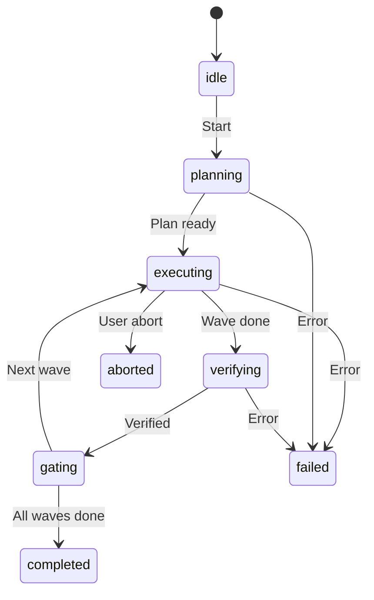

# Dark Factory

Autonomous execution mode for running multi-step task plans without manual intervention. Dark Factory decomposes a plan into waves of parallel tasks, each verified by independent verifier agents before proceeding.

## Concept

Dark Factory is "spec in, software out." You provide a specification, and ARC orchestrates multiple agents to implement it in waves — with consensus gates ensuring quality at each step.

```
Spec → Planning → Wave 1 → Verify → Wave 2 → Verify → ... → Complete
```

## Starting a Factory Run

```bash
arc factory start <spec-file>
arc factory status
arc factory abort
```

::: warning
Dark Factory is designed for batch operations like codebase migrations, multi-file refactors, and test generation. It runs autonomously — use `arc factory abort` to halt execution at the next consensus gate.
:::

## State Machine

The factory controller follows a strict state machine:

```
idle → planning → executing → verifying → gating → completed
                      ↑                      │
                      └──────────────────────┘
                         (retry on reject)
```

| State | Description |
|-------|-------------|
| `idle` | No active factory run |
| `planning` | Decomposing spec into waves and tasks |
| `executing` | Running tasks within the current wave |
| `verifying` | Independent verifier agents checking results |
| `gating` | Consensus gate — all verifiers must agree to proceed |
| `completed` | All waves finished successfully |



## Wave Model

Tasks within a wave run in parallel. The consensus gate at the end of each wave ensures all verifiers agree before advancing to the next wave.

```typescript
interface FactorySpec {
  description: string;
  waves: FactoryWave[];
  consensus: {
    minVerifiers: number;      // Minimum verifiers per gate
    unanimousRequired: boolean; // All must agree, or majority
  };
}

interface FactoryWave {
  name: string;
  tasks: FactoryTask[];
  dependsOn?: string[];        // Previous wave names
}
```

## Consensus Gates

At the end of each wave, verifier agents independently review the results. The gate configuration determines how many must agree:

- **Unanimous** — all verifiers must approve (safest, default)
- **Majority** — more than half must approve (faster)

If any verifier rejects, the wave is retried or escalated to the user.

## Wave Progression

```bash
arc factory status
```

Status output shows:

- Current state (planning/executing/verifying/gating)
- Current wave name and progress
- Tasks completed vs. total per wave
- Verifier results at each gate
- Overall progress percentage

## Aborting

```bash
arc factory abort
```

Halts execution at the next consensus gate. Tasks already running will complete, but no new tasks will start. The factory state transitions to `idle`.

Dark Factory builds on ARC's [multi-agent orchestration](/features/orchestration) primitives — task delegation assigns work to agents, and roundtable-style reviews can serve as consensus gates.

## Use Cases

- **Codebase migrations** — update import paths, API calls, or config formats across hundreds of files
- **Multi-file refactors** — rename a module, update all references, fix tests
- **Test generation** — generate unit tests for an entire package
- **Documentation** — generate or update docs for changed APIs
- **Dependency updates** — update a dependency and fix all breaking changes

## Monitoring

The web dashboard provides real-time factory monitoring via the `/api/factory` endpoint. The Factory view shows wave progression, task status, and verifier results with live WebSocket updates.
